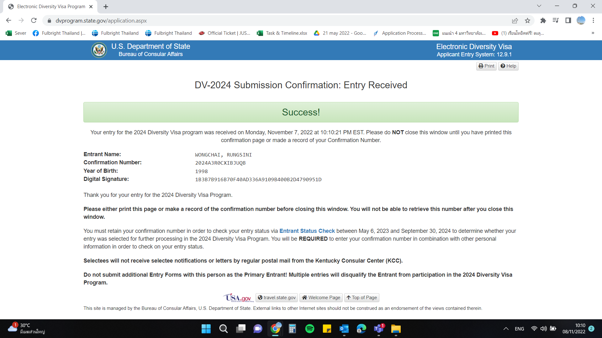

# Rungsini's Portfolio

# [Project 1: Models for the number of cases with Dengue Hemorrhagic Fever](hyperlink)

*This project was conducted as part of my bachelor's research paper, wherein I developed a predictive model to estimate the number of cases of dengue hemorrhagic fever (DHF). The primary objective of this study was to identify an appropriate model that could accurately forecast the incidence of DHF patients in various provinces across Thailand.*

**Data Sources:**
*This research study is a retrospective descriptive study, conducted through a review of historical data.*
- The dengue cases were obtained from the Disease Control Office (No. 506) of the Department of Disease Control, comprising a total of 140,256 individuals.
- Population data was sourced from the National Statistical Office.
- Geographical information was obtained from the Energy Conservation in the Public Sector project.
- Hospital data was provided by the Ministry of Public Health.
- Average temperature and rainfall data were collected from the Meteorological Department.

**Study Details:**
- The study population consisted of dengue cases reported in each province of Thailand from January 2017 to June 2020.
- The study period spanned 42 months or 3 years and 6 months, starting from January 2560 to June 2563.

**Research Objective:**
- The research aimed to investigate the applicability of the Generalized Least Squares method in developing an appropriate model for predicting the number of dengue cases.

**Data Analysis and Statistics Used:**
*The data was processed using the R programming language, specifically R Version 4.0.3. The data analysis involved the application of the following statistical techniques:*
- *Descriptive Analysis:* Describing the characteristics of the independent variables, which included average temperature, rainfall amount, population size, area size, and the number of hospitals. The dependent variable was the number of cases of dengue hemorrhagic fever.
- *Correlation Analysis:* Employing Spearman's correlation method to examine the relationships between variables.
- *Graphical Presentation:* Creating informative graphs to illustrate the patterns and relationships of the variables more clearly.
- *Regression Analysis:* Analyzing the relationships between the average temperature, rainfall amount, population size, area size, number of hospitals, and the number of cases of dengue hemorrhagic fever. The Generalized Least Squares method, a commonly used regression technique, was employed to develop a model for predicting the number of dengue hemorrhagic fever cases.

# [Project 2: Models for Medical Expenses caused by Viral Infections in Thailand](hyperlink)

This was part of an internship project where a SPSS was used in order to created ....

# [Project 3: Visualization with rapid miner](hyperlink)

This was part of a relevent course where a Rapid Miner was used in order to created data visualization ....
