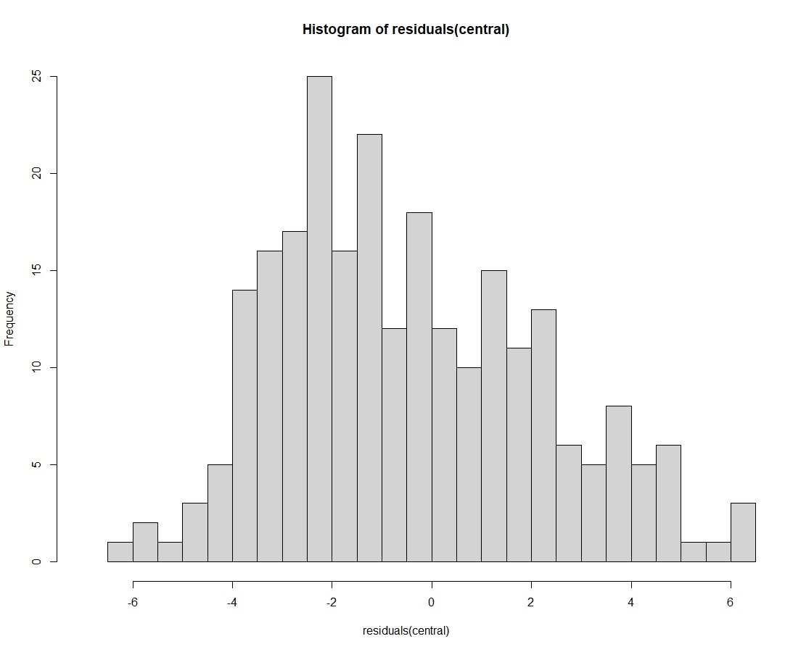

# [Project 1: Models for the number of cases with Dengue Hemorrhagic Fever]

## This project, conducted as part of my bachelor's research paper, aimed to achieve the following objectives:
- To examine appropriate models for estimating the prevalence of Dengue Hemorrhagic Fever (DHF) among patients in different regions of Thailand.
- To explore the factors associated with the incidence of Dengue Hemorrhagic Fever (DHF).
- To present the findings using visually engaging and informative graphs.

## **Data Sources:**
*This project is a retrospective descriptive study, conducted through a review of historical data.*
- The dengue cases were obtained from the Disease Control Office (No. 506) of the Department of Disease Control, comprising a total of 140,256 individuals.
- Population data was sourced from the National Statistical Office.
- Geographical information was obtained from the Energy Conservation in the Public Sector project.
- Hospital data was provided by the Ministry of Public Health.
- Average temperature and rainfall data were collected from the Meteorological Department.

## **Study Details:**
- The study population consisted of dengue cases reported in each province of Thailand from January 2017 to June 2020.
- The study period spanned 42 months or 3 years and 6 months, starting from January 2560 to June 2563.
- Variables studied: Province, Region, Year, Month, Average Temperature, Rainfall Amount, Population Size, Area, Number of Hospitals.
- The study investigated the number of cases of Dengue Hemorrhagic Fever in the Central, Eastern, Western, and Southern regions of Thailand, utilizing data from all 52 provinces in the country.

## **Data Cleaning:**
*Data was collected from various sources and compiled in Excel for preparation in SPSS for the subsequent cleaning process.*
- Importing the Data: The secondary data collected from various sources is imported into SPSS.
- Data Inspection: The imported data undergoes a visual inspection to identify any inconsistencies, missing values, or formatting issues.
- Handling Missing Values: Missing values are handled by examining the extent and patterns of missingness. Depending on the situation, they can be deleted, imputed using appropriate methods, or treated as a separate category.
- Dealing with Outliers: Outliers, which are extreme values deviating significantly from the rest of the data, are identified and appropriately addressed. They can be removed, recoded, or analyzed separately.

## **Data Analysis and Statistics Used:**
*The data was processed using the R programming language. The data analysis involved the application of the following statistical techniques:*

### **1. Data Visualization:** 
*Creating informative graphs to illustrate the patterns and relationships of the variables more clearly.*

#### Example :
- **Y-axis: Number of DHF (Cases) and X-axis: Time (Months)** 

- **Y-axis: Number of DHF (Cases) and X-axis: Time (Months)-Divided by Geographic Region** 

 

The Spaghetti Plot, depicting the number of dengue fever patients each year categorized by region, reveals a similar pattern across all regions. In each year, the number of patients tends to increase. There is a peak point during the rainy season of each year where the number of patients reaches its highest. Additionally, the data suggests a seasonal cyclicality.

- **Y-axis: Number of DHF (Cases) and X-axis: Average Temperature (°C)** 

 

The Scatter Plot shows the relationship between dengue fever cases and average temperature. It reveals a concentration of cases within the 28-32 degrees Celsius temperature range. However, caution is warranted due to potential data collection inconsistencies and Thailand's consistently warm climate, which ranges from 28-35 degrees Celsius on average. Therefore, definitive conclusions about data accuracy cannot be drawn from this graph alone.

- **Y-axis: Number of DHF (Cases) and X-axis: Rainfall Amount (Millimeters)** 

From the Scatter Plot, which displays the number of patients with dengue fever and the rainfall quantity, it can be observed that the graph line tends to increase and extend horizontally. Generally, a higher number of patients are observed in the range of 0-500 millimeters of rainfall. However, it is still difficult to draw significant conclusions from the data.

- **Y-axis: Number of DHF (Cases) and X-axis: Population Size (Individuals)** 

 

The graph demonstrates a positive correlation between the number of dengue fever patients and the population count. As the population increases in each province, there is a clear trend of the number of patients also increasing.

- **Y-axis: Number of DHF (Cases) and X-axis: Area (Square Kilometers)** 

From the scatter plot graph depicting the number of dengue fever patients and the area size, it can be observed that the graph trend is not very distinct. This is because Bangkok, the capital city, has a relatively small area compared to its population. Additionally, Bangkok's status as the capital leads to a high concentration of people residing there. As a result, the number of patients does not align well with the area size.

- **Y-axis: Number of DHF (Cases) and X-axis: Number of Hospitals (Units)** 

The scatter plot clearly shows a noticeable trend between the number of dengue fever patients and the number of hospitals: as the number of hospitals increases, the number of patients tends to increase as well. However, it may not accurately represent the true trend due to the significantly higher number of hospitals in Bangkok (138) compared to other provinces, where the number of hospitals does not exceed 50. This suggests that the data from Bangkok heavily influences the upward trajectory of the graph.

- **For additional R code, please refer to the following GitHub repository:** [graph_code.R](https://github.com/rungsini/rungsini-portfolio/blob/f83c734c54f87be5800fa53964aefb2d838cc98e/graph_code.R)

### **2. Descriptive Analysis:** 
*Describing the characteristics of the independent variables, which included average temperature, rainfall amount, population size, area size, and the number of hospitals. The dependent variable was the number of cases of dengue hemorrhagic fever.*

| Variable        | Min     | Max       | Mean   | S.D.       |
| --------------- | ------- | --------- | ------ | ---------- |
| Cases           | 0       | 1,709     | 64.22  | 139.4      |
| Avg.temp        | 19.4    | 33.5      | 27.92  | 1.9006     |
| Rainfall        | 6       | 1,772.70  | 148.8  | 170.3908   |
| Population      | 177,338 | 5,686,646 | 957,267| 831,763.20 |
| Area            | 543     | 20,494    | 8,209  | 4,702.68   |
| No. of Hospital | 6       | 138       | 19.38  | 19.0732    |

The table reveals the following characteristics:
- Number of patients: Min = 0, Max = 1,709, Average = 64.22 (right-skewed)
- Average temperature: Min = 19.4°C, Max = 33.5°C, Average = 27.92°C (relatively symmetrical)
- Rainfall amount: Min = 6 mm, Max = 1,772.70 mm, Average = 148.8 mm (right-skewed)
- Population size: Min = 177,338, Max = 5,686,646, Average = 957,267 (right-skewed)
- Area size: Min = 543 sq km, Max = 20,494 sq km, Average = 8,209 sq km (moderately right-skewed)
- Number of hospitals: Min = 6, Max = 138, Average = 19.38 (right-skewed)

### **3. Correlation Analysis:** 
*Employing Spearman's correlation method to examine the relationships between variables.*

| Variable        | Correlation Coefficient | p-value | 
| --------------- | ----------------------- | -----   | 
| Cases           | 1.000                   | -       |
| Avg.temp        | 0.290*                  | 0.000   | 
| Rainfall        | 0.134*                  | 0.000   | 
| Population      | 0.418*                  | 0.000   | 
| Area            | 0.100*                  | 0.000   | 
| No. of Hospital | 0.382*                  | 0.000   | 
*The statistical significance level at 0.05.

From Table, which the correlation coefficients for average temperature, rainfall amount, population size, area size, and number of hospitals are 0.290, 0.134, 0.418, 0.100, and 0.382, respectively. All factors have a p-value of 0.000, indicating a significant correlation with the number of dengue hemorrhagic fever cases. Therefore, these factors will be used to develop a suitable model.

### **4. Regression Analysis:** 
*Analyzing the relationships between the average temperature, rainfall amount, population size, area size, number of hospitals, and the number of cases of dengue hemorrhagic fever. **The Generalized Least Squares** method, a commonly used regression technique, was employed to develop a model for predicting the number of dengue hemorrhagic fever cases.*

#### Example : Model for the number of dengue fever patients in the central region.
- **Multiple Linear Regression Model:** 

`Number of DHF (Cases) ~ Year + Month + Average Temperature + Rainfall Amount + Population Size + Area + Number of Hospitals`

- **Preliminary Examination:** 
From the graph, it can be observed that the residuals do not meet the assumption of randomness and show a pattern. The Normal Q-Q plot indicates that the data is not significantly deviating from normal distribution. Most of the data points used for analysis are not outliers.

- **Autocorrelation Examination:** 
Upon examining the autocorrelation function (ACF) and partial autocorrelation function (PACF) plots, the following patterns can be observed. 
From the figure, it is evident that the model has a p = 2 and a q = 2, which can be represented by the following equation

- **Autoregressive Moving Average (ARMA(2,2)):** 

`Y_t = δ + 0.3010*Y_{t-1} + 0.4632*Y_{t-2} + u_t - 0.7905*u_{t-1} - 0.1025*u_{t-2}`

The analysis reveals autocorrelation in the residuals, indicating a lack of independence. Additionally, there are issues of non-constant variance. To address these problems, the data was analyzed using the generalized least squares method. The resulting model is as follows.

- **Generalized Least Squares (GLS):** 

`√Number of DHF (Cases) ~ Year + Month + Average Temperature + Rainfall Amount + Population Size^2 + Area + Number of Hospitals`

and when examining the variance and autocorrelation within the variable itself, the following patterns are observed

- **Variance Assessment of GLS Model:** 

The scatter plot of residuals against predicted values shows random dispersion around zero without any clear pattern, indicating constant variance (homoscedasticity).

- **Autocorrelation Examination in GLS Model:** 

From the figure, it is evident that the model has a p = 0 and a q = 0, indicating no significant autocorrelation. Additionally, the regression analysis table is obtained as follows.

- **The Regression Coefficients Table Obtained from GLS Model:**

| Variable       | Coefficient | Standard Error | t-value          | p-value |
| -------------- | ----------- | -------------- | ---------------- | ------- |
| (Intercept)    | -3.820116   | 5.185944       | -0.736629        | 0.4620  |
| 2561           | -0.819349   | 0.594308       | -1.378661        | 0.1692  |
| 2562           | -1.402175   | 0.462402       | -3.032375        | 0.0027  |
| 2563           | -0.475562   | 0.349215       | -1.361804        | 0.1745  |
| Feb            | -0.172045   | 0.137995       | -1.246745        | 0.2137  |
| Mar            | 1.045374    | 0.615364       | 1.698790         | 0.0906  |
| Apr            | -3.482190   | 0.799438       | -4.355799        | 0.0000  |
| May            | -1.159636   | 0.704213       | -1.646713        | 0.1009  |
| Jun            | 2.597360    | 0.462181       | 5.619790         | 0.0000  |
| Jul            | -0.531709   | 0.467026       | -1.138500        | 0.2560  |
| Aug            | -1.176431   | 0.339141       | -3.468857        | 0.0006  |
| Sep            | 1.052470    | 0.256250       | 4.107206         | 0.0001  |
| Oct            | -0.035020   | 0.211972       | -0.165211        | 0.8689  |
| Nov            | -0.210175   | 0.183035       | -1.148278        | 0.2520  |
| Dec            | 0.156560    | 0.163766       | 0.955998         | 0.3400  |
| Avg.Temp       | 0.265764    | 0.152322       | 1.744754         | 0.0823  |
| Rainfall       | 0.001560    | 0.001064       | 1.466362         | 0.1438  |
| Population     | -0.000011   | 0.000007       | -1.655837        | 0.0990  |
| Population^2^  | 0.000000    | 0.000000       | 1.048774         | 0.2953  |
| Area           | 0.000602    | 0.000205       | 2.942650         | 0.0036  |
| No. of Hospital| 0.316682    | 0.140885       | 2.247801         | 0.0255  |

From Table, the p-values for average temperature, rainfall amount, population, and population squared are 0.0823, 0.1438, 0.0990, and 0.2953, respectively. These factors are not statistically significant at the 0.05 level and do not affect the number of dengue fever cases. Therefore, they are excluded from the model, resulting in the optimal model for the number of dengue fever cases in the central region as...

- **Adjusted GLS Model in Central Region:** 

`√Number of DHF (Cases) ~ Year + Month + Area + Number of Hospitals` 

and when examining the variance and autocorrelation within the variable itself, the following patterns are observed

- **Variance Assessment of Adjusted GLS Model:** 

The graph shows a plot of residuals against estimated values. The distribution is randomly scattered around the zero axis, without a clear pattern. This indicates constant variability, suggesting a constant variance.

- **Autocorrelation Examination in Adjusted GLS Model:** 

Based on the observed graph, it can be concluded that there is no autocorrelation present. This implies that the residuals exhibit independence, indicating a lack of correlation between consecutive data points.

- **Histogram of residuals in the central region:** 

Based on the graph, it is evident that the residuals follow an approximately normal distribution, resembling a normal distribution. This indicates that the adjusted model is well-suited for this dataset. Upon analysis, the regression analysis table is obtained as presented below.

- **The Regression Coefficients Table Obtained from Adjusted GLS Model:**

| Variable        | Coefficient | Standard Error | t-value   | p-value |
|-----------------|-------------|----------------|-----------|---------|
| (Intercept)     | 1.246239    | 1.2833433      | 0.971088  | 0.3324  |
| 2561            | -0.611631   | 0.5793777      | -1.055669 | 0.2921  |
| 2562            | -1.512549   | 0.4607218      | -3.282998 | 0.0012  |
| 2563            | -0.272062   | 0.3325581      | -0.818088 | 0.4141  |
| Feb             | -0.163333   | 0.1388104      | -1.176661 | 0.2404  |
| Mar             | 0.450990    | 0.4823958      | 0.934895  | 0.3507  |
| Apr             | -4.406418   | 0.6430366      | -6.852516 | 0.0000  |
| May             | -0.529713   | 0.5946856      | -0.890745 | 0.3739  |
| Jun             | 2.287857    | 0.4164362      | 5.493896  | 0.0000  |
| Jul             | -0.005708   | 0.3659854      | -0.015595 | 0.9876  |
| Aug             | -0.881540   | 0.2895860      | -3.044138 | 0.0026  |
| Sep             | 1.042274    | 0.2543669      | 4.097522  | 0.0001  |
| Oct             | -0.120981   | 0.2117574      | -0.571319 | 0.5683  |
| Nov             | -0.152349   | 0.1821371      | -0.836452 | 0.4037  |
| Dec             | 0.104366    | 0.1641569      | 0.635770  | 0.5255  |
| Area            | 0.000310    | 0.0001361      | 2.277237  | 0.0236  |
| No. of Hospital | 0.100957    | 0.0278067      | 3.630665  | 0.0003  |

From the table, it can be observed that if other factors remain constant, an increase in area by 1 square kilometer will result in an increase of 0.000310 √people in the number of patients. Similarly, an increase in the number of hospitals by 1 will lead to an increase of 0.100957 √people in the number of patients. Additionally, if we want to predict the number of patients in March, it will increase from January of the year 2560 (intercept) by 0.450990 √people. Based on this table, a suitable model can be constructed.

- **Appropriate Model for the Number of Dengue Hemorrhagic Fever Cases in Central Regions of Thailand:** 

`√Ŷ = 1.246239 - 0.611631*D1 - 1.512549*D2 - 0.272062*D3 - 0.163333*M1 + 0.450990*M2 - 4.406418*M3 - 0.529713*M4 + 2.287857*M5 - 0.005708*M6 - 0.881540*M7  + 1.042274*M8 - 0.120981*M9 - 0.152349*M10 + 0.104366*M11 + 0.000310*X_Area + 0.100957*X_No. of Hospital`

- **Example of Model Usage:** If we want to forecast the number of patients with Dengue Hemorrhagic Fever in June, 2561, with an area size of 1,568.737 square kilometers and 138 hospitals, the equation would be as follows:

`√Ŷ = 1.246239 - 0.6116317(1) + 2.287857(1) + 0.000310(1,568.737) + 0.100957(138)`

Therefore, the estimated number of Dengue Hemorrhagic Fever patients in the central region provinces is approximately equal to 

`Ŷ = "17.3408"²` = `300.7047` ≈ `301 individuals`

- **For additional R code, please refer to the following GitHub repository:** [model_code.R](https://github.com/rungsini/rungsini-portfolio/blob/d27804ded75a89b8d5b13e542b8d01439916d6bb/model_code.R)
